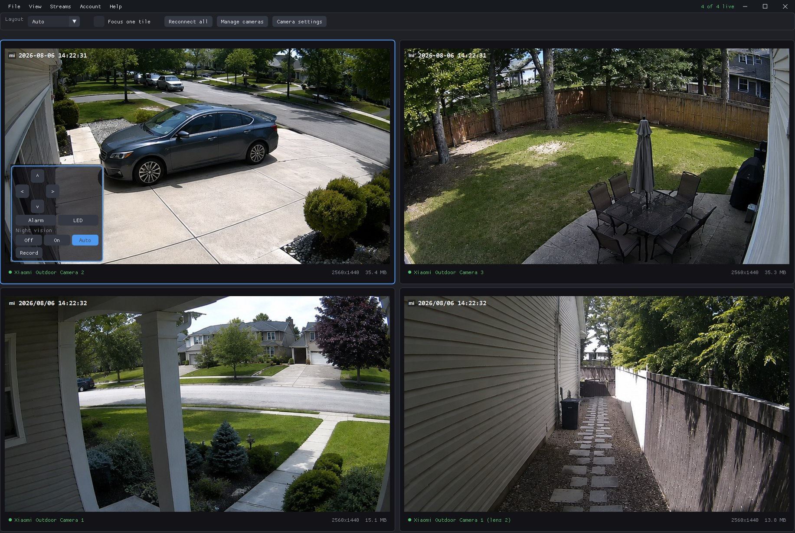

# Xiaomi Camera Viewer

A native Windows application for watching and controlling Xiaomi CW400 and CW500
cameras. One executable, no Docker, no WSL, no browser.

Video travels straight from the camera to your PC over the local network.
Xiaomi's cloud is used only to sign in, list your devices, exchange the
per-session encryption keys, and read or write camera settings.



Four cameras in the automatic grid, with the control pad on the selected tile.
The pictures in the tiles are stand-ins rather than real camera output.

## Features

- Live view of several cameras at once, in a 1x1, 2x2, 3x3 or automatic grid
- Hardware HEVC and H.264 decoding through Direct3D 11 video acceleration
- Pan and tilt with a hold-to-move pad
- Recording to Matroska (`.mkv`) files, remuxed rather than re-encoded, so a
  recording is the camera's own stream at its own quality and costs no CPU
- Camera settings driven by the device's own MIoT specification: night vision,
  HDR, image flip, motion detection and sensitivity, tracking, fill light,
  siren, indicator LED, recording mode and SD card status
- Both lenses of a dual-lens CW500 as independent tiles
- Automatic reconnection with backoff when a camera drops the session
- Sign-in handles captchas and two-step verification; the resulting token is
  stored encrypted with your Windows account key

Out of scope for now: playback of recordings from the camera's SD card, two-way
audio, and audio in recordings. The bridge already surfaces audio packets, so
listening in can be added without redesign.

Playback is out of scope because the cameras will not discuss it, not because
nobody has written the UI. MISS names a playback request, response and speed
command (0x10D, 0x10E, 0x10F); no payload for any of them is documented, no
public implementation sends one, and a CW400 and a CW500 answered fourteen
candidate payloads with complete silence -- no reply, no error, no change in the
media flow, and nothing on the two transport channels this bridge does not open.
Device info (0x110) answers on the same session, so the path is sound and the
command really is being ignored. Since the camera never rejects anything, a
wrong payload and an unsupported command look identical, which leaves nothing to
search against. `scripts/probe-playback.ps1` is that experiment, kept so the
next attempt starts from the evidence rather than repeating it.

## Requirements

- Windows 10 1809 or newer, 64-bit
- A GPU supporting Direct3D 11 feature level 11.0 with video acceleration.
  Any Intel, AMD or NVIDIA GPU from roughly 2014 onward qualifies.
- Cameras on the same local network as the PC. Xiaomi cameras refuse
  connections from another subnet, so a VPN or a routed VLAN will not work.
- A Mi account, with the correct server region for your cameras

## Getting started

Run `XiaomiViewer.exe`, sign in with your Mi account, and pick your region. The
region must match the one the Mi Home app uses; the wrong one produces an empty
device list rather than an error, because Xiaomi shards accounts by region.

Then open **Cameras**, press **Refresh from account**, and add the cameras you
want. A dual-lens CW500 offers both lenses separately. The grid starts streaming
as soon as a camera is added.

Click a tile to select it, or walk through them with `Tab` and `Shift+Tab`.
Double-click a tile, or press `F`, to focus a single camera; `Esc` goes back. The
arrow keys pan and tilt the selected camera, holding the movement for as long as
the key is down, and `R` starts or stops recording it. While the live grid is on
screen these keys belong to the cameras, so Tab does not walk the toolbar there
the way it does on the other screens.

The focused tile gets a control pad in its bottom-left corner. Its arrows pan and
tilt, and they are left out for a lens with no motor behind it, which the fixed
second lens of a CW500 is. Under them are the three settings worth reaching
without leaving the picture -- the audible alarm, the fill light (the `LED`
button) and night vision -- and a camera that does not offer one of them does not
show it. Everything else lives in the settings panel.

## Recording

`Record` on the pad, or `R`, writes the focused camera's stream to
`Videos\XiaomiViewer\<camera> <date> <time>.mkv`. **Streams -> Open recordings
folder** goes there, and `recordings_dir` in the configuration file moves it.

Nothing is re-encoded: the camera's own H.265 or H.264 access units are put into
a Matroska container as they arrive. A recording is therefore pixel-identical to
what the camera sent, at whatever bitrate and frame rate it chose, and it costs a
few percent of one core rather than a GPU encoder.

Two consequences of recording the stream rather than a re-encode of it. A file
can only begin on a keyframe, so recording starts within a second or two of
being asked rather than instantly; the pad says `starting` until it does. And a
session that drops ends its file and the reconnection opens a new one, because
two sessions do not share a timeline. Recordings are video only for now.

Only one copy runs at a time, per signed-in user. Launching it again brings the
running one to the front rather than starting a second, which would compete with
the first for the cameras.

There is no Windows title bar: the menu bar is the title bar, with minimize,
maximize and close drawn at its right end. Dragging the empty part of it moves
the window and double-clicking maximizes, and everything Windows does with a
normal frame still works — the resize edges, Aero Snap, Win+arrow, Alt+Space,
and the Windows 11 snap layouts flyout when the mouse rests on maximize.

The window opens where it was closed, maximized if it was left maximized. A
saved position is dropped in favour of the default when less than half of the
window would land on a monitor, so unplugging the screen it was on does not
leave it somewhere it cannot be dragged back from.

Settings and the log live under the **View** menu. Configuration is stored in
`%APPDATA%\XiaomiViewer\config.json`, next to a log file that is worth reading
first if a camera will not connect.

## Building

You need Visual Studio 2026 with the C++ toolset, plus Go and mingw-w64 for the
protocol bridge:

```powershell
winget install --id GoLang.Go
winget install --id BrechtSanders.WinLibs.POSIX.UCRT
```

Then:

```powershell
.\scripts\fetch-deps.ps1     # Dear ImGui, nlohmann/json, prebuilt FFmpeg
.\scripts\build.ps1          # configure and build everything
.\scripts\build.ps1 -Package # ...and stage a redistributable folder in dist\
```

`build.ps1` finds Visual Studio itself and uses its bundled CMake and Ninja, so
no developer command prompt is needed. The Go bridge is built as a dependency of
the executable, so a plain `cmake --build` also works from the IDE.

Tests:

```powershell
cd bridge; go test ./...          # protocol and dispatch logic
.\scripts\test-bridge-abi.ps1     # the C ABI, against the real DLL
```

## How it works

```
XiaomiViewer.exe (MSVC)                     xmbridge.dll (Go)
  Dear ImGui + D3D11  ──── C ABI, JSON ────►  Mi cloud: login, devices, MIoT
  libavcodec HEVC     ◄─── access units ────  MISS protocol over CS2 P2P
  D3D11 video processor                              │
                                                     ▼
                                              camera on the LAN
```

The split exists because the hard part of talking to these cameras is not the
video, it is Xiaomi's account request signing, the Curve25519 key exchange and
the CS2 transport. [go2rtc](https://github.com/AlexxIT/go2rtc) already implements
all of that correctly in about 50 KB of Go, so that code is vendored into a
C-ABI DLL rather than hand-ported. When upstream fixes a protocol change, the
fix can be pulled in as a diff. `bridge/NOTICE.md` records exactly what was
taken and what was changed.

The application above it does UI, decode and render only. Decoding goes through
libavcodec's D3D11VA path rather than Media Foundation, whose HEVC decoder needs
a paid extension from the Microsoft Store. Decoded surfaces stay on the GPU: the
video processor converts them to RGB and scales them without a trip through
system memory.

The control plane is a single JSON-in, JSON-out entry point, so adding features
does not churn the ABI. Video frames get dedicated functions and stay in the
Annex-B form the camera sends, which is exactly what libavcodec's parser wants,
so nothing rewrites bitstreams anywhere along the path.

## Discovery

The CS2 handshake starts with a "LAN search" datagram on UDP 32108. go2rtc sends
it only to the camera's address, but the CW400 family ignores that and answers
only the subnet broadcast, which is why those cameras time out under go2rtc with
nothing at all coming back.

This app therefore sends the search to both the camera and the directed
broadcast of whichever local subnet contains it, and accepts the reply only from
the camera it asked for. Cameras answer from a random high port, not from 32108.

The cloud's address for a camera is also just a cache, and for some cameras it
is missing entirely. When that happens the camera is located by broadcasting the
same discovery packet and matching the MAC from the device list against the
replies, so a camera with no cloud address still works.

## Stream quality

Xiaomi's numeric quality profiles mean different things on different models, and
"High" picks the right one per model. The mapping was measured rather than
guessed:

| Model | Profile 1 | Profile 2 | Profile 3 |
| --- | --- | --- | --- |
| CW400 `isa.camera.hlc8a` | 640x360 | connects, sends nothing | 2560x1440 |
| CW500 `isa.camera.500dh` | 640x360 | 640x360 | 2560x1440 |

If a camera not in the table gives no picture or a small one on **High**, pick a
numbered profile under **Override** in the Cameras view. `scripts/probe-quality.ps1`
sweeps every profile against a real camera and reports what each returns.

## Pan and tilt

The camera is pointed over the same peer-to-peer connection the video arrives on,
with MISS command `0x112`. Nothing documents its payload and go2rtc never sends
the command, so the shape was found by trying candidates against a camera and
watching where the lens ended up. What these models accept is
`{"operation":N}`, where 1 and 2 pan and 3 and 4 tilt. The
`{"direction":"left","speed":5}` form that other third-party projects send is
accepted silently and does nothing at all.

One command moves one fixed step and the motor stops on its own, so there is no
stop command and holding a direction simply repeats the step. The camera reports
where it ended up in its reply, which is how the mapping from each arrow to each
motor was checked rather than assumed.

`scripts/probe-ptz.ps1` does all of this against a live camera: `-Mode step`
checks that every arrow moves the axis it claims, and the other modes are there
for working out a model that does not respond to the payload above.

## Known limitations

- **A camera that is switched off cannot be found.** Discovery covers a camera
  that moved, or that the cloud has no address for, but not one that is not on
  the network. The log tells the two apart: it says so explicitly when other
  devices answer the broadcast and the camera being opened does not.
- **Only cameras on the same subnet work.** Xiaomi cameras refuse peer-to-peer
  connections from another subnet, and the discovery broadcast does not cross
  routers either. A VPN or a routed VLAN will not do.
- **Pan and tilt moves in steps, not smoothly.** The camera only accepts "move
  one step", so holding a direction repeats that step. How far one step goes is
  the camera's decision and differs a lot between models: roughly 16 degrees on
  a CW400 against under 2 on a CW500.
- **Another client can take the motor.** With a second session open to the same
  camera, from the Mi Home app for instance, motor commands are accepted and then
  ignored. The picture keeps arriving, so this looks like broken pan and tilt
  rather than a camera that is busy. The app will not run twice for the same
  reason: launching it again brings the running copy to the front instead.
- Cameras negotiating a transport other than CS2 (older TUTK-based models) are
  rejected with a clear message rather than silently failing.
- Audio is received and counted but not played.

## Credits and licensing

The Xiaomi protocol implementation is derived from
[go2rtc](https://github.com/AlexxIT/go2rtc) by Alexey Khit, under the MIT
license. This project would not exist without that reverse-engineering work.

See [THIRD-PARTY-NOTICES.md](THIRD-PARTY-NOTICES.md) for the full list of
dependencies and their licenses.

This project is not affiliated with, endorsed by, or supported by Xiaomi.
